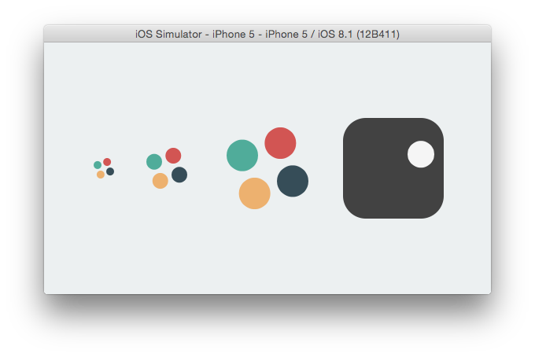

FlatPreloadersSwift
===================

A collections of iOS custom ActivityIndicators, written in Swift with a Flat touch.

With this collection I want to replicate a beautiful set of preloader gifs made by [Pixel Buddha](http://pixelbuddha.net/freebie/flat-preloaders).

Practically speaking I'll make those as iOS native components

**Wish me luck**

## All preloaders
Every preloaded will behave as a **UIViewActivityIndicator** so:

	var hidesWhenStopped : Bool = true
>A Boolean value that controls whether the receiver is hidden when the animation is stopped.

    func startAnimating()
>Starts the animation of the preloader.
When the progress indicator is animated, the dots spins to indicate indeterminate progress.
The indicator is animated until `stopAnimating` is called.

    func stopAnimating()
>Stops the animation of the progress indicator.
Call this method to stop the animation of the progress indicator started with a call to `startAnimating`. When animating is stopped, the indicator is hidden, unless `hidesWhenStopped` is `false`.

    func isAnimating() -> Bool
>Returns whether the receiver is animating. Returns`true` if the receiver is animating, otherwise `false`.

All preluders comes also with **three default styles**: *Small* (32pt), *Medium* (64pt) and *Big* (128pt) for lazy people `FlatPreloader.Style`.

## Type A

	preloaderSmall = FlatPreloaderTypeA(style: FlatPreloader.Style.Small)
	preloaderMedium = FlatPreloaderTypeA(style: FlatPreloader.Style.Medium)
	preloaderBig = FlatPreloaderTypeA(style: FlatPreloader.Style.Big)

or with customizations for creative people:

    :param: frame                   The loader frame.
    :param: dotsDistance            The minimum distance between dots. Defaults to 0.0.
    :param: dotsColors              The dots colors (a tuple of four colors). Defaults to all black.
    :param: animationDuration       The animation (single complete rotation) duration. Defaults to 2.52.
    :param: reverseAnimation        If true, the animation will go counterclockwise. Defaults to false
    :param: padding                 The dots inset from external frame. Defaults to 0.0.
    :param: automaticCornerRadius   If true, the backing layer will automatically resize its cornerRadius value. Defaults to false.

All but `frame` are optional attributes.
## next
When it's done

##License
This code is distributed under the terms and conditions of the [MIT license](LICENSE). 